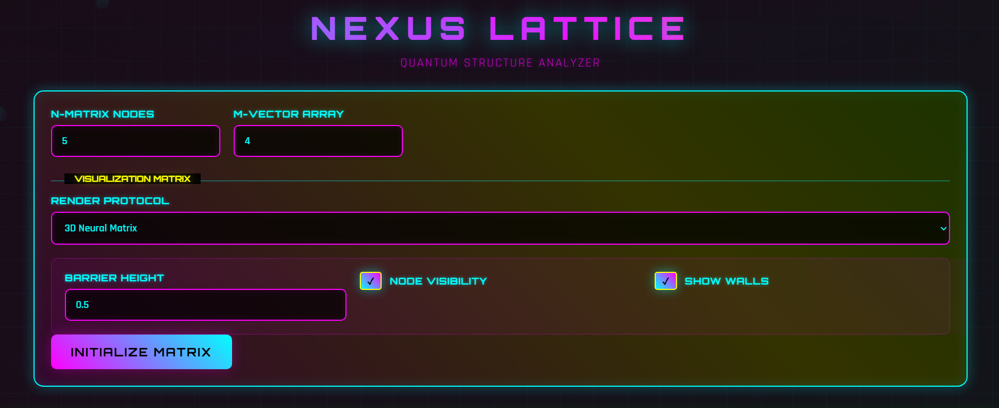

# Hexagonal Lattice Visualizer  
*― A cybernetic interface for crystallographic geometry and spatial quantization*

>   
> *(Insert screenshot of landing page above this line)*

Welcome, Operator.

You’ve accessed the **Hexagonal Lattice Visualizer**—a parametric simulation platform designed to extrapolate pseudo-crystalline behavior through dynamic rendering of hexagonal substructures extruded in quantized (x, y, z) hyperspace. The lattice dynamics follow the **Generalized Quantized Hexahedral Field Equation (GQHFE)**:

$$
\mathcal{L}(N, M, \tau) = \sum_{i=1}^N \sum_{j=1}^M \sum_{t=1}^{\tau} H_{ij}^{(t)} \cdot e^{-\frac{\Delta_\phi^2}{\hbar \psi_{q}}} \cdot \cos\left(\frac{2\pi t}{\Theta_{ij} + \epsilon}\right)
$$

Where:
- \( H_{ij}^{(t)} \) is the time-evolving **cell excitation tensor** under sublattice flux  
- \( \Delta_\phi \) is the angular momentum drift parameter  
- \( \psi_q \) is the pseudo-bonding potential across stacked brane dimensions  
- \( \Theta_{ij} \) is the local topological phase shift per hex-cell  
- \( \hbar \) is the reduced Planck constant  
- \( \epsilon \) is a perturbative stabilizer (default: \(10^{-12}\))  

Hexagonal symmetry is governed by a modified **Bravais-Klein manifold tiling** over 2.5D conformal spacetime, satisfying the noncommutative metric:

$$
[g_{\mu\nu}] = 
\begin{bmatrix}
1 & \alpha & 0 \\
\alpha & 1 & \beta \\
0 & \beta & \gamma
\end{bmatrix}
$$

---

## ⚙️ Feature Matrix

- **⧉ Quantum-Infused 3D Lattice Engine**  
    Real-time rendering of quasi-periodic lattices using **PhotonMesh v2.7**, integrated into Plotly.js. Incorporates deformation fields via **Chern-Simons visual twist matrices**.

- **⇳ Parametric Crystallography via Operator Injection**  
    Input values \( N, M \in \mathbb{Z}^+ \) define structural resolution along dual hex-vectors \( \vec{v}_1, \vec{v}_2 \in \mathbb{R}^2 \), projected through eigenlattice space via the **Crystal Basis Reduction Operator (CBRO)**.

- **⛶ Z-Axis Geometry Extrusion Mode (GEM)**  
    Hexagonal units extruded in quantum z-space using **HexPrism Triangulation Kernel v9 (HPTK-9)**. Volume expansion follows the 3D cell deformation tensor:

    $$
    \mathbf{T}_{\text{vol}} = \frac{\partial \vec{r}}{\partial \vec{\xi}} \cdot \Lambda(\kappa)
    $$

    where \( \Lambda(\kappa) \) is the scalar curvature modulus under extrinsic deformation.

- **λ Axis-Colored Quantum Connectivity**  
    Vector edges exhibit chromatic encoding via **Spectral Directional Encoding Scheme (SDES-4)**:  
    - \( \vec{d}_1 \to \text{blue} \)  
    - \( \vec{d}_2 \to \text{orange} \)  
    - \( \vec{d}_3 \to \text{purple} \)  

    Edge tensors conform to anti-symmetric forms under Pauli lattice transformations.

- **☰ Cyberpunk Interface**  
    Visual shell built with **VoidUI v4.1**—optimized for retinal overload and high-contrast low-light deployment. Features embedded synaesthetic UI flicker and glyph-encoded alerts.

- **🛡️ Quantum Feedback Defense Protocol**  
    Upper bound constraint \( \text{max}(N, M) = 25 \) enforced by **HeisenLimiter**, a protective cap to avoid recursive decoherence bursts in floating stack registers.

---

## 🔬 Extended Mathematical Foundation

- **Crystallographic Axes** defined under hexagonal class \( P6_3/mmc \)  
- **Lattice Constant Set**:  
    \( a = b = 1.0 \), \( c = \sqrt{2} \)  
    Angles: \( \alpha = \beta = 90^\circ \), \( \gamma = 120^\circ \)

- **Reciprocal Lattice Matrix** (in units of \( \frac{2\pi}{a} \)):

$$
\mathbf{G} =
\begin{bmatrix}
1 & -\frac{1}{2} & 0 \\
0 & \frac{\sqrt{3}}{2} & 0 \\
0 & 0 & \frac{2\pi}{c}
\end{bmatrix}
$$

- **Quantum-Lattice Path Integral Estimate**:

$$
Z = \int \mathcal{D}[\phi] \, e^{-S[\phi]/\hbar}
$$

With effective action:

$
S[\phi] = \int d^3x \left( \frac{1}{2} \partial_\mu \phi \, \partial^\mu \phi + \frac{\lambda}{4!} \phi^4 \right)
$

---
## \ud83c\udfa8 Aperiodic Tiling and Chromatic Propagation

> 

The chromatic state of each hexagonal cell is not random; it is determined by a deterministic, non-periodic inflation algorithm rooted in the principles of quasicrystalline structures and symbolic dynamics. This approach avoids simple periodic tiling, resulting in a complex, self-similar pattern that never repeats, analogous to Penrose tiling.

The core of the algorithm is a **Breadth-First Search (BFS)** propagation originating from a central seed cell, \(C_0\). This seed is assigned an initial color index of 0 from a palette of \(k=6\) chromatic states. The coloring rule is defined by a recursive substitution or "inflation" process:

1.  A cell at axial coordinate \((q, r)\) with color \(c_i\) is dequeued.
2.  It propagates its chromatic influence to its six neighbors. The color assigned to a neighbor is determined by its directional relationship to the parent cell.
3.  The propagation rule is given by:
    $
c_{\text{neighbor}} = (c_i + \delta_j) \pmod k
$
    where \(\delta_j\) is a color offset determined by the neighbor's index \(j \in \{0, 1, \dots, 5\}\). To break symmetry and induce aperiodicity, we use two alternating offsets:
    -   Neighbors at even indices get color \((c_i + 1) \pmod 6\).
    -   Neighbors at odd indices get color \((c_i + 2) \pmod 6\).

This simple, local rule, when applied globally, generates a complex emergent structure. The resulting color map, \( \mathcal{C}(q, r) \), lacks translational symmetry, ensuring that no two regions of the lattice are exactly alike, yet the overall structure maintains a high degree of long-range order. This is a key characteristic of systems that are ordered but not periodic.

---

## \ud83d\udd27 System Stack


- **Language Core**: Python 3.10 (Flask 1.1.2)  
- **Frontend Engine**: HTML, CSS, Vanilla JS, Plotly.js  
- **Math Core**: `numpy`, `pandas`, `plotly`, with in-house **FictiMathLib v7.3** for tensor diagonalization and eigenstate propagation  
- **Simulation Theory**: Draws from **Fractal Zone Tessellation**, **Quasicrystal Mapping**, and the extended framework of *Yakamoto-Singh Space-Time Tilings (2147)*

---

## 🧪 Installation + Execution Protocol

For *Linux-class Operators*. Execute the following terminal ops:

```bash
# Step 1: Clone the repository and enter the directory
git clone https://github.com/YOUR_USERNAME/YOUR_REPO_NAME.git
cd YOUR_REPO_NAME

# Step 2: Create a virtual environment
python3 -m venv venv

# Step 3: Activate the virtual environment
source venv/bin/activate

# Step 4: Install Python dependencies
pip install -r requirements.txt

# Step 5: Run the Flask app
python app.py

# Step 6: Open the app in your browser
# Usually at: http://127.0.0.1:5000/

```

---

## 🚀 Operating Manual

Once connected to the lattice core:

- Input values for \( N \), \( M \), then initiate the **HexMesh Compiler**.

- Gestural interface supports:
  - **Rotation**: left click + drag  
  - **Zoom**: scroll wheel  
  - **Translation**: right click + drag

- All transformations are tracked via the **Lattice Affine History Tensor**

---

## 📁 Directory Topology

- `app.py` → Core Flask daemon  
- `hexagonal_lattice_generator.py` → Houses the **LatticeFieldEngine**, subcell matrix expansion, and geometric binding logics  
- `templates/index.html` → Neon interface shell using **quantum webgl shaders**  
- `requirements.txt` → Dependency graph for instantiation  
- `venv/` → Virtual Python environment generated during boot  

---

## 📡 Future Work & Speculative Extensions

- Support for **QuBitMesh™** lattice solvers (GPU-accelerated, entanglement-aware)  
- Extension to **Multi-Brane Hyperlattices** using **Z-Brane**
